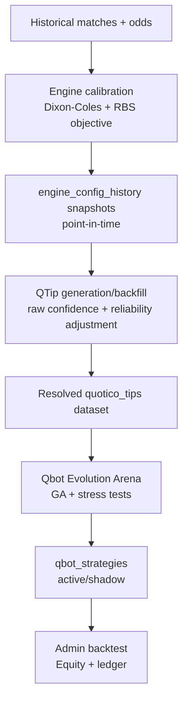

# Mathematical Methods (Engine -> Time Machine -> QTips -> Qbot)

This document summarizes the core mathematical procedures currently used in Quotico.

## 1) High-Level Flow

## 2) Prediction Engine (Match Probabilities)

Primary model: Dixon-Coles style goal model with league-specific parameters:
- `rho` (low-score correlation adjustment)
- `alpha_time_decay` (recency weighting)
- `alpha_weight_floor` (minimum recency weight)

### Key mechanics
- Time-weighted team strengths (recent matches weighted higher).
- Optional xG blending into goal intensity features.
- Fatigue/rest-day modifiers on lambdas.
- Optional H2H blending (weight capped by sample size).

## 3) Calibration Objective (Optimizer)

The optimizer minimizes regularized Brier score over historical resolved matches.

- Pure Brier (3-way):
  - `BS = mean(sum_{o in {1,X,2}} (p_o - y_o)^2)`
- Regularized Brier:
  - `RBS = BS + lambda_reg * L2_penalty(params - priors)`

It also tracks:
- Log-likelihood
- Per-outcome calibration error (`home/draw/away`)

## 4) Reliability Layer (Meta-Calibration)

Purpose: correct systemic over/underconfidence on historical tips.

Inputs: resolved tips with `confidence` and `was_correct`.

### Band analysis
- Default: static confidence bands.
- Fallback: quantile-based bands if too few static bands are populated.

Per band:
- Bayesian-smoothed win rate:
  - `wr_smooth = (wins + prior_strength * prior_wr) / (n + prior_strength)`
- Reliability factor:
  - `rf = wr_smooth / avg_confidence`

League outputs:
- `multiplier` (global confidence scaling)
- `cap` (upper ceiling)
- `regression_factor` (pull toward average win rate if monotonicity fails)
- `avg_win_rate`

Applied to raw confidence:
1. scale with multiplier
2. cap at `cap`
3. regress toward league average by `regression_factor`

## 5) Engine Time Machine (Temporal Leakage Control)

Goal: build point-in-time monthly snapshots in `engine_config_history`.

### Core principles
- Only data available before snapshot date is used.
- Carry-forward when recalibration is rejected or not meaningful.
- `--with-reliability` can attach point-in-time reliability context.

### Quality controls
- Step-wise RBS worsening gate (vs previous snapshot).
- Cumulative drift check (vs last truly calibrated snapshot anchor).
- Staleness detection via consecutive carry-forwards.
- Off-season skip: if too few new matches, carry-forward directly.

## 6) QTip Confidence Construction

Raw confidence combines edge + signal boosts, then gets reliability-adjusted.

Pipeline (conceptual):
1. Base confidence from edge (sigmoid around edge threshold)
2. Additive signal effects (momentum, sharp/steam, H2H, rest, EVD, etc.)
3. Clamp to bounds
4. Apply reliability correction (`multiplier`, `cap`, `regression_factor`)

Output tip fields include:
- `confidence` (adjusted)
- `raw_confidence`
- explanatory tier signals

## 7) Qbot Evolution Arena (Strategy Optimization)

Optimizes DNA parameters such as:
- min edge/confidence filters
- signal weights
- Kelly fraction
- max stake
- volatility buffer
- venue/H2H/Bayesian trust modifiers

### Fitness (weighted, modern-era aware)
- Time weighting over lookback horizon (linear decay with floor).
- Uses weighted ROI, weighted weekly Sharpe, weighted drawdown penalty.
- Soft sample-size penalty (sigmoid-based) instead of hard kill.

Conceptually:
- `fitness_base = a*ROI + b*Sharpe - c*MaxDD`
- `fitness = fitness_base - lambda * (1 - sigmoid(bet_count - min_bets))`

### Robustness layer
- Stage 1 ideal search, optional Stage 2 relaxed search space.
- Pareto frontier over ROI, volume, ruin risk, drawdown.
- Bootstrap test (`p_positive`, CI).
- Monte Carlo bankroll paths with ruin probability + drawdown stats.
- Rescue loop: iterative Kelly/max-stake downscaling if ruin too high.
- Candidate/test caching to avoid repeated expensive simulations.

## 8) Backtest Service (Admin Consistency View)

For a selected strategy, it simulates bankroll path and ledger entries.

Key rules:
- Stake based on current bankroll and Kelly logic.
- Hard risk brake: `stake <= min(dna.max_stake, bankroll * 0.05)`.
- Same confidence/filter/stake logic family as arena.
- Lookback window defaults (or validation window / `since_date` override).

Outputs:
- Equity curve points
- Weighted ROI/profit/staked metrics
- Bet ledger (stake, odds, P/L, bankroll progression)

## 9) Why This Stack Works

- Time machine prevents temporal leakage.
- Reliability corrects confidence miscalibration.
- Arena optimizes decision/risk layer on realized tip history.
- Stress tests and Pareto selection avoid one-metric overfitting.
- Backtest mirrors strategy behavior for auditability in admin UI.
